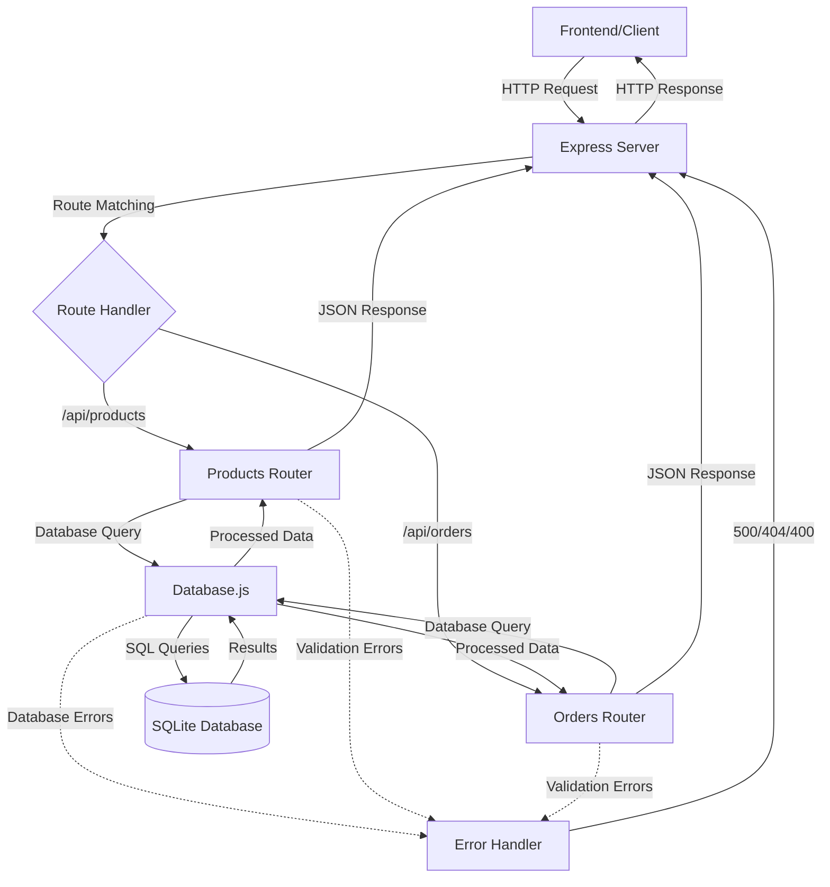

# 🎯 FakeShop Backend 

## 📋 ÖVERSIKT AV BACKEND-ARKITEKTUREN

### **Teknisk Stack:**
- **Node.js** - JavaScript runtime för servern
- **Express.js** - Web framework för API:er
- **SQLite** - Lättvikts-databas för utveckling
- **RESTful API** - Standardiserad kommunikation mellan frontend och backend

---

## 🗂️ MAPPSTRUKTUR OCH ORGANISATION

```
server/
├── app.js                 # Huvudserver och routing
├── models/
│   ├── database.js        # Databashantering och SQL-queries
│   └── init-database.js   # Databasskapande och initial data
└── routes/
    ├── products.js        # Produkthantering API
    └── orders.js          # Orderhantering API
```

---

## 🚀 1. HUVUDSERVERN (app.js)

**Funktionaliteter:**
- **Express server setup** på port 3000
- **CORS-hantering** för frontend-kommunikation
- **Static file serving** för HTML/CSS/JS
- **API routing** - dirigerar requests till rätt endpoints
- **Centraliserad felhantering**

**Nyckelkomponenter:**
```javascript
// Server initialisering
// Middleware för JSON-parsing
// Route-koppling till /api/products och /api/orders
// Databasinitialisering vid start
```

---

## 🗄️ 2. DATABASHANTERING (models/)

### **A. Database.js - Kärn-databasoperationer:**

**Produkthantering:**
- `getAllProducts()` - Hämta alla produkter
- `getProductById(id)` - Hämta specifik produkt
- `createProduct(data)` - Skapa ny produkt
- `updateProduct(id, data)` - Uppdatera befintlig produkt
- `deleteProduct(id)` - Ta bort produkt

**Orderhantering:**
- `createOrder(orderData)` - Skapa komplett order med produkter
- `getAllOrders()` - Hämta alla ordrar med statistik
- `getOrderById(id)` - Detaljerad orderinformation
- `updateOrderStatus(id, status)` - Ändra orderstatus

### **B. Init-database.js - Databasinitialisering:**
- **Skapa tabeller** med rätt schema
- **Sätta upp relationer** mellan orders och order_items
- **Lägg till testdata** för utveckling

---

## 🛍️ 3. PRODUKT-API (routes/products.js)

**CRUD-operationer:**

### **GET /api/products**
- Hämtar alla produkter
- Sorterat efter senast skapade först
- Returnerar komplett produktlista

### **GET /api/products/:id**
- Hämtar specifik produkt med ID
- 404-hantering om produkten inte finns
- Används för produktdetaljer och redigering

### **POST /api/products**
- Skapar ny produkt
- Validering av obligatoriska fält
- Automatisk ID-generering

### **PUT /api/products/:id**
- Uppdaterar befintlig produkt
- Endast angivna fält uppdateras
- Validering av produktens existens

### **DELETE /api/products/:id**
- Tar bort produkt permanent
- Kontrollerar produktens existens först

---

## 📦 4. ORDER-API (routes/orders.js)

**Huvudfunktionaliteter:**

### **POST /api/orders**
- **Komplex orderhantering** med transaktioner
- Skapar order + order_items samtidigt
- Genererar unikt ordernummer
- Beräknar totalsumma automatiskt

### **GET /api/orders**
- Hämtar alla ordrar med sammanfattning
- Inkluderar produktsammanfattning för varje order
- Sorterat efter senaste först

### **GET /api/orders/:id**
- **Detaljerad ordervy** med alla produkter
- Joinade data från orders, order_items och products
- Komplett kundinformation

### **PUT /api/orders/:id/status**
- Uppdaterar orderstatus
- Validering av giltiga statusvärden
- För admin-hantering

---

## 🔧 5. TEKNISKA FUNKTIONALITETER

**Felhantering:**
- Strukturerad error handling i alla endpoints
- HTTP-statuskoder (200, 404, 500)
- Användaranpassade felmeddelanden

**Datavalidering:**
- Obligatoriska fält-kontroll
- Datatyp-validering
- SQL injection-skydd

**Databas-relationer:**
- **One-to-Many**: En order kan ha många order_items
- **Foreign Keys**: Säkerställer datainteggritet
- **Transaktioner**: Säkerställer konsistent data

---

## 📊 6. API-ENDPOINTS SAMMANFATTNING

| Method | Endpoint | Funktion |
|--------|----------|----------|
| GET | `/api/products` | Lista alla produkter |
| GET | `/api/products/:id` | Hämta specifik produkt |
| POST | `/api/products` | Skapa ny produkt |
| PUT | `/api/products/:id` | Uppdatera produkt |
| DELETE | `/api/products/:id` | Ta bort produkt |
| GET | `/api/orders` | Lista alla ordrar |
| GET | `/api/orders/:id` | Hämta specifik order |
| POST | `/api/orders` | Skapa ny order |
| PUT | `/api/orders/:id/status` | Uppdatera orderstatus |

---

## 🧪 CURL-KOMMANDON FÖR API-TESTNING

### **Produkter (Products)**

#### **1. Hämta alla produkter**
```bash
curl -X GET http://localhost:3000/api/products \
  -H "Content-Type: application/json" | jq
```

#### **2. Hämta specifik produkt**
```bash
curl -X GET http://localhost:3000/api/products/1 \
  -H "Content-Type: application/json" | jq
```

#### **3. Skapa ny produkt**
```bash
curl -X POST http://localhost:3000/api/products \
  -H "Content-Type: application/json" \
  -d '{
    "name": "Test T-Shirt",
    "brand": "TestBrand",
    "description": "En testprodukt för demonstration",
    "price": 299.99,
    "sku": "TST001",
    "image_url": "/images/product.png",
    "category": "tshirts",
    "stock_quantity": 50
  }' | jq
```

#### **4. Uppdatera befintlig produkt**
```bash
curl -X PUT http://localhost:3000/api/products/1 \
  -H "Content-Type: application/json" \
  -d '{
    "name": "Uppdaterad T-Shirt",
    "price": 349.99,
    "stock_quantity": 25
  }' | jq
```

#### **5. Ta bort produkt**
```bash
curl -X DELETE http://localhost:3000/api/products/1 \
  -H "Content-Type: application/json" | jq
```

### **Ordrar (Orders)**

#### **6. Hämta alla ordrar**
```bash
curl -X GET http://localhost:3000/api/orders \
  -H "Content-Type: application/json" | jq
```

#### **7. Hämta specifik order**
```bash
curl -X GET http://localhost:3000/api/orders/1 \
  -H "Content-Type: application/json" | jq
```

#### **8. Skapa ny order (komplex)**
```bash
curl -X POST http://localhost:3000/api/orders \
  -H "Content-Type: application/json" \
  -d '{
    "customer_name": "John Doe",
    "customer_email": "john.doe@example.com",
    "customer_phone": "070-123 45 67",
    "shipping_address": "Testgatan 123, 12345 Stockholm",
    "payment_method": "card",
    "items": [
      {
        "id": 36,
        "name": "Premium Kappa",
        "brand": "Calvin Klein",
        "quantity": 1,
        "price": 1299
      },
      {
        "id": 5,
        "name": "Hot Tröja",
        "brand": "Tommy Hilfiger",
        "quantity": 2,
        "price": 549
      }
    ]
  }' | jq
```

#### **9. Uppdatera orderstatus**
```bash
curl -X PUT http://localhost:3000/api/orders/1/status \
  -H "Content-Type: application/json" \
  -d '{
    "status": "completed"
  }' | jq
```

### **Testsekvens för komplett flöde:**
```bash
# 1. Skapa server-session och testa att den svarar
curl -X GET http://localhost:3000/api/products

# 2. Skapa en testprodukt
curl -X POST http://localhost:3000/api/products \
  -H "Content-Type: application/json" \
  -d '{"name": "Demo Produkt", "brand": "Demo", "price": 199, "sku": "DEM001", "category": "tshirts", "stock_quantity": 10}'

# 3. Skapa en order med produkten
curl -X POST http://localhost:3000/api/orders \
  -H "Content-Type: application/json" \
  -d '{"customer_name": "Test Kund", "customer_email": "test@example.com", "shipping_address": "Test 123", "payment_method": "card", "items": [{"id": 1, "name": "Demo Produkt", "brand": "Demo", "quantity": 1, "price": 199}]}'

# 4. Uppdatera orderstatus
curl -X PUT http://localhost:3000/api/orders/1/status \
  -H "Content-Type: application/json" \
  -d '{"status": "shipped"}'
```

---

## 🔄 DATAFLÖDE (Data Flow)



### **Detaljerat Request/Response Flöde:**

```
1. Frontend → Express Server
   ├── CORS Check
   ├── JSON Parser
   └── Route Matching

2. Route Handler → Database Layer
   ├── Input Validation
   ├── SQL Query Preparation
   └── Database Execution

3. Database → Route Handler
   ├── Result Processing
   ├── Error Handling
   └── Response Formatting

4. Route Handler → Frontend
   ├── Status Code Setting
   ├── JSON Serialization
   └── HTTP Response
```

---

## 🗄️ DATABASSTRUKTUR (Database Schema)

```
┌─────────────────────────────────────────────────────────────────┐
│                        PRODUCTS TABLE                           │
├─────────────────────────────────────────────────────────────────┤
│ id (INTEGER PRIMARY KEY AUTOINCREMENT)                         │
│ name (TEXT NOT NULL)                                           │
│ brand (TEXT NOT NULL)                                          │
│ description (TEXT)                                             │
│ price (DECIMAL NOT NULL)                                       │
│ sku (TEXT UNIQUE NOT NULL)                                     │
│ image_url (TEXT)                                               │
│ category (TEXT)                                                │
│ stock_quantity (INTEGER DEFAULT 0)                             │
│ is_active (BOOLEAN DEFAULT 1)                                  │
│ created_at (DATETIME DEFAULT CURRENT_TIMESTAMP)                │
│ updated_at (DATETIME DEFAULT CURRENT_TIMESTAMP)                │
└─────────────────────────────────────────────────────────────────┘
                                │
                                │ (One-to-Many Relationship)
                                │
                                ▼
┌─────────────────────────────────────────────────────────────────┐
│                       ORDER_ITEMS TABLE                        │
├─────────────────────────────────────────────────────────────────┤
│ id (INTEGER PRIMARY KEY AUTOINCREMENT)                         │
│ order_id (INTEGER) ────────────────────────┐                   │
│ product_id (INTEGER) ──────────────────────┼─── FOREIGN KEYS    │
│ product_name (TEXT NOT NULL)               │                   │
│ product_brand (TEXT NOT NULL)              │                   │
│ quantity (INTEGER NOT NULL)                │                   │
│ price (DECIMAL NOT NULL)                   │                   │
│ subtotal (DECIMAL NOT NULL)                │                   │
│ created_at (DATETIME DEFAULT CURRENT_TIMESTAMP)                │
└─────────────────────────────────────────────────────────────────┘
                                ▲
                                │ (Many-to-One Relationship)
                                │
┌─────────────────────────────────────────────────────────────────┐
│                         ORDERS TABLE                           │
├─────────────────────────────────────────────────────────────────┤
│ id (INTEGER PRIMARY KEY AUTOINCREMENT)                         │
│ order_number (TEXT UNIQUE NOT NULL)                            │
│ customer_name (TEXT NOT NULL)                                  │
│ customer_email (TEXT NOT NULL)                                 │
│ customer_phone (TEXT)                                          │
│ shipping_address (TEXT NOT NULL)                               │
│ payment_method (TEXT)                                          │
│ total_amount (DECIMAL NOT NULL)                                │
│ status (TEXT DEFAULT 'pending')                                │
│ created_at (DATETIME DEFAULT CURRENT_TIMESTAMP)                │
│ updated_at (DATETIME DEFAULT CURRENT_TIMESTAMP)                │
└─────────────────────────────────────────────────────────────────┘
```

### **Relationer och Constraints:**

```sql
-- PRIMARY KEYS
products.id (Auto-increment)
orders.id (Auto-increment)
order_items.id (Auto-increment)

-- FOREIGN KEYS
order_items.order_id → orders.id
order_items.product_id → products.id

-- UNIQUE CONSTRAINTS
products.sku (Måste vara unikt)
orders.order_number (Genereras automatiskt, unikt)

-- INDEXES
CREATE INDEX idx_orders_customer_email ON orders(customer_email);
CREATE INDEX idx_orders_created_at ON orders(created_at);
CREATE INDEX idx_products_category ON products(category);
CREATE INDEX idx_order_items_order_id ON order_items(order_id);
```

### **Datatyper och Validering:**

| Tabell | Fält | Typ | Validering |
|--------|------|-----|------------|
| products | price | DECIMAL | > 0 |
| products | stock_quantity | INTEGER | >= 0 |
| products | sku | TEXT | Format: ABC123 |
| orders | status | TEXT | pending/completed/shipped/cancelled |
| order_items | quantity | INTEGER | > 0 |
| order_items | subtotal | DECIMAL | quantity × price |

---
